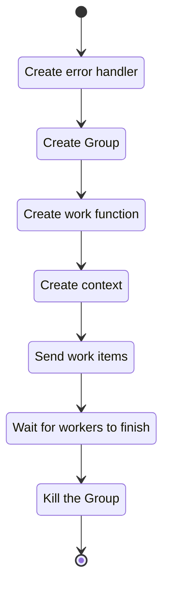

[](https://goreportcard.com/report/gitlab.com/MicahParks/ctxerrgroup)[](https://pkg.go.dev/gitlab.com/MicahParks/ctxerrgroup)
# ctxerrgroup
Groups of goroutines that understand context.Context and error handling.

# Benefits
* Async error handling simplified.
* Familiar methods.
  * `Done` method mimics `context.Context`'s.
  * `Wait` method mimics `sync.WaitGroup`'s.
* Flat and simple.
  * Only exported struct is `ctxerrgroup.Group`.
* MIT License.
* No dependencies outside of the packages included with the Golang compiler.
* Small code base.
  * Two source files with less than 350 lines of code including lots of comments.
* Test coverage is greater than 90%.
* The group and its workers will all be cleaned up with `group.Kill()`. (All work sent to the group should exit as well,
if it respects its own context.)

# Full example
This example will use a worker group to HTTP GET https://golang.org 16 times and print the status codes with a logger.
```go
package main

import (
	"bytes"
	"context"
	"log"
	"net/http"
	"os"
	"time"

	"gitlab.com/MicahParks/ctxerrgroup"
)

func main() {

	// Create an error handler that logs all errors.
	var errorHandler ctxerrgroup.ErrorHandler
	errorHandler = func(group ctxerrgroup.Group, err error) {
		log.Printf("An error occurred. Error: \"%s\".\n", err.Error())
	}

	// Create a worker group with 8 workers and a buffer that can queue work functions. Do not handle errors in a
	// separate goroutine.
	group := ctxerrgroup.New(4, 8, false, errorHandler)

	// Create some variables to inherit through a closure.
	httpClient := &http.Client{}
	u := "https://golang.org"
	logger := log.New(os.Stdout, "status codes: ", 0)

	// Create the worker function.
	var work ctxerrgroup.Work
	work = func(ctx context.Context) (err error) {

		// Create the HTTP request.
		var req *http.Request
		if req, err = http.NewRequestWithContext(ctx, http.MethodGet, u, bytes.NewReader([]byte{})); err != nil {
			return err
		}

		// Do the HTTP request.
		var resp *http.Response
		if resp, err = httpClient.Do(req); err != nil {
			return err
		}

		// Log the status code.
		logger.Println(resp.StatusCode)

		return nil
	}

	// Do the work 16 times.
	for i := 0; i < 16; i++ {

		// Create a context for the work.
		ctx, cancel := context.WithTimeout(context.Background(), time.Second)

		// Send the work to the group.
		group.AddWorkItem(ctx, cancel, false, work)
	}

	// Wait for the group to finish.
	group.Wait()
}
```

# Usage

## Simple Diagram
Here is a simple state diagram with one job:


## Basic Workflow

### Create an error handler
---
The very first step to using a worker group is creating an error handler. The worker group is expecting all work to
match the `ctxerrgroup.Work` function signature: `type Work func(ctx context.Context) (err error)`.

Error handlers have the function signature of `type ErrorHandler func(group Group, err error)` where the first argument
is the `ctxerrgroup.Group` that the error handler is handling errors for and the second argument is the most recent
error reported from a worker.

The example error handler below logs all errors with the build in logger.
```go
// Create an error handler that logs all errors.
var errorHandler ctxerrgroup.ErrorHandler
errorHandler = func(group ctxerrgroup.Group, err error) {
	log.Printf("An error occurred. Error: \"%s\".\n", err.Error())
}
```

### Create a worker group
---
After the error handler has been created, the worker group can be created.
```go
// Create a worker group with 8 workers and a buffer that can queue work functions. Do not handle errors in a
// separate goroutine.
group := ctxerrgroup.New(4, 8, false, errorHandler)
```

The first argument is the number of workers. The number of workers is the maximum number of goroutines that can be
working on work at any one time. If the number of workers is 0, the group will be useless.

The second argument is the buffer size. The buffer size is the quantity of ctxerrgroup.Work functions that are queued to
be sent to the group. If the buffer size is zero, all calls to `group.AddWorkItem` will block until a worker is free to
accept the given work (unless the `async` argument is set to `true`).

The third argument indicates whether error should be handled asynchronously. If set to `true` a new goroutine will be
used to handle every error outgoing from the worker group. A value of `false` will cut down on the amount of goroutines
used, but block future workers with errors until the error handler returns.

The fourth argument is the error handler created in the previous step.

### Create work
---
Work sent to the worker group must match the `ctxerrgroup.Work` function signature: `type Work func(ctx context.Context)
(err error)` and is expected to respect its given context, `ctx`. If the context is not respected and the worker group
is killed, the goroutine performing the work will leak.

Here is an example of some work that respects its context:
```go
// Create the worker function.
var work ctxerrgroup.Work
work = func(ctx context.Context) (err error) {

	// Create the HTTP request.
	var req *http.Request
	if req, err = http.NewRequestWithContext(ctx, http.MethodGet, u, bytes.NewReader([]byte{})); err != nil {
		return err
	}

	// Do the HTTP request.
	var resp *http.Response
	if resp, err = httpClient.Do(req); err != nil {
		return err
	}

	// Log the status code.
	logger.Println(resp.StatusCode)

	return nil
}
```

Here is an example of some work that does the same thing without respecting its own context:
```go
// Create the worker function.
var work ctxerrgroup.Work
work = func(ctx context.Context) (err error) {

	// Create the HTTP request.
	var req *http.Request
	if req, err = http.NewRequest(http.MethodGet, u, bytes.NewReader([]byte{})); err != nil {
		return err
	}

	// Do the HTTP request.
	var resp *http.Response
	if resp, err = httpClient.Do(req); err != nil {
		return err
	}

	// Log the status code.
	logger.Println(resp.StatusCode)

	return nil
}
```

Since most functions do not match the `ctxerrgroup.Work` signature,
[function closures](https://tour.golang.org/moretypes/25) are typically the desired way to create worker functions.
```go
// Create some variables to inherit through a closure.
httpClient := &http.Client{}
u := "https://golang.org"
logger := log.New(os.Stdout, "status codes: ", 0)

// Create the worker function.
var work ctxerrgroup.Work
work = func(ctx context.Context) (err error) {

	// Create the HTTP request.
	var req *http.Request
	if req, err = http.NewRequestWithContext(ctx, http.MethodGet, u, bytes.NewReader([]byte{})); err != nil {
		return err
	}

	// Do the HTTP request.
	var resp *http.Response
	if resp, err = httpClient.Do(req); err != nil {
		return err
	}

	// Log the status code.
	logger.Println(resp.StatusCode)

	return nil
}
```

### Create a context
---
Work and context have a 1:1 relationship when used in a worker group. Each context's cancel function is called on work
completion. Never send work with a context with a context that has been used before.

Here is an example of what *not* to do:
```go
// This context will cause up to 4 jobs to fail.
ctx, cancel := context.WithTimeout(context.Background(), time.Second)

// Do the work 16 times.
for i := 0; i < 16; i++ {

	// Send the work to the group.
	group.AddWorkItem(ctx, cancel, false, work)
}
```
Instead, create the context in the loop and do not shadow a context variable from out of scope.
```go
// Do the work 16 times.
for i := 0; i < 16; i++ {

	// Create a context for the work.
	ctx, cancel := context.WithTimeout(context.Background(), time.Second)

	// Send the work to the group.
	group.AddWorkItem(ctx, cancel, false, work)
}
```

### Send work
---
```go
// Wait for the group to finish.
group.Wait()
```

The first and second arguments are the unique context and cancellation functions for the given work.

The third argument indicates if the work should be sent asynchronously. If `true`, the `SendWork` method will not block
when sending work to the worker group. This effectively creates a buffer of infinity work functions ready to be sent to
worker goroutines. If set to `true`, an additional goroutine will be created to send the work to a worker in the group.
If `false` the `SendWork` method will block if the group's buffer is full and no worker is ready for more work. (The
buffer was created when the group was created.)

The fourth argument is the work function created in a previous step.

### Let the work finish
---
```go
group.Wait()
```
or
```go
<-group.Done()
```
Both statements will block until the worker group has completed all given work. The `Done` method is idea for `select`
statements.

### Clean up the worker group
---
```go
group.Kill()
```
Killing the worker groups isn't required, but if the worker group is no longer being used it's best to tell all its
goroutines to return to reclaim their resources. If the program's `main` function is about to end, `group.Kill()` will
be accomplished regardless.

# Test Coverage
Testing coverage for this repository is currently greater than 90%. Depending on how Go runtime schedules things,
certain paths may or may not be executed. This is based on a sample of 1000 tests with coverage and race detection. All
tests pass without any detected race conditions.

If you are interested in test coverage, please view the `cmd/coverage.go` tool and the `cmd/profiles` directory. The
directory has log output from the tool and testing coverage profiles for multiple samples of the 1000 tests.

In my experience, test coverage that counts the number of lines executed can be a misleading number. While I believe the
current written tests adequately cover the code base, if there are test cases that are not covered by the current
testing files, please feel free to add an issue requesting the test case or create an MR that adds tests.
